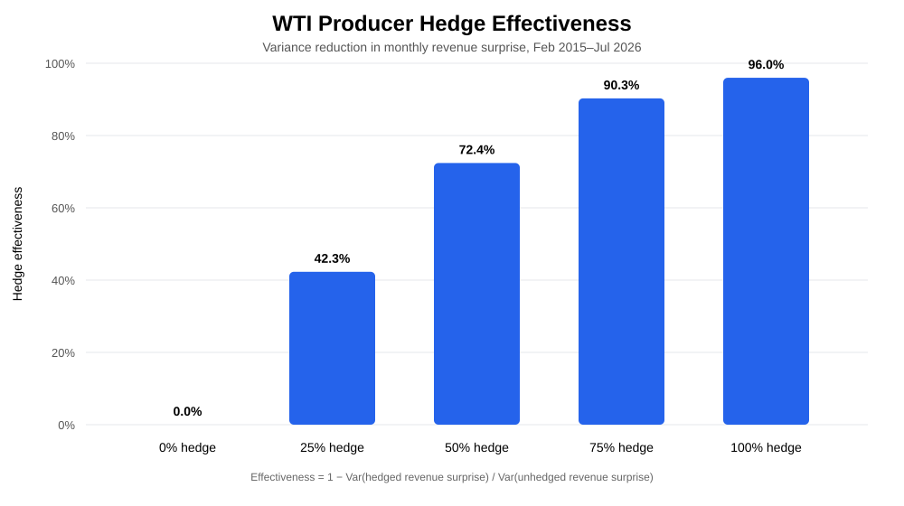
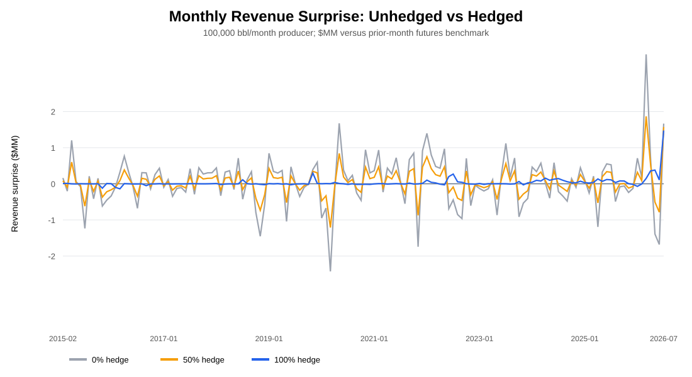
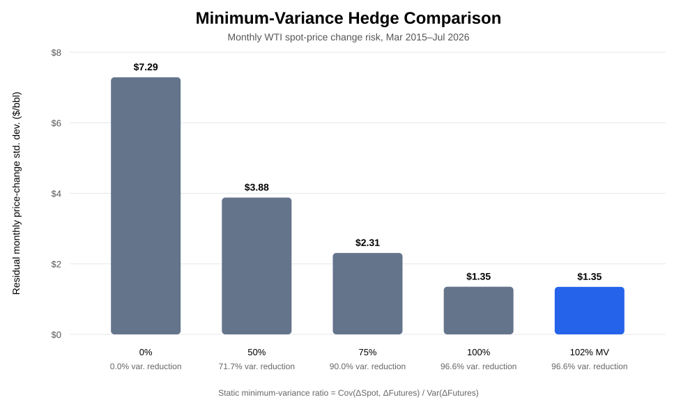
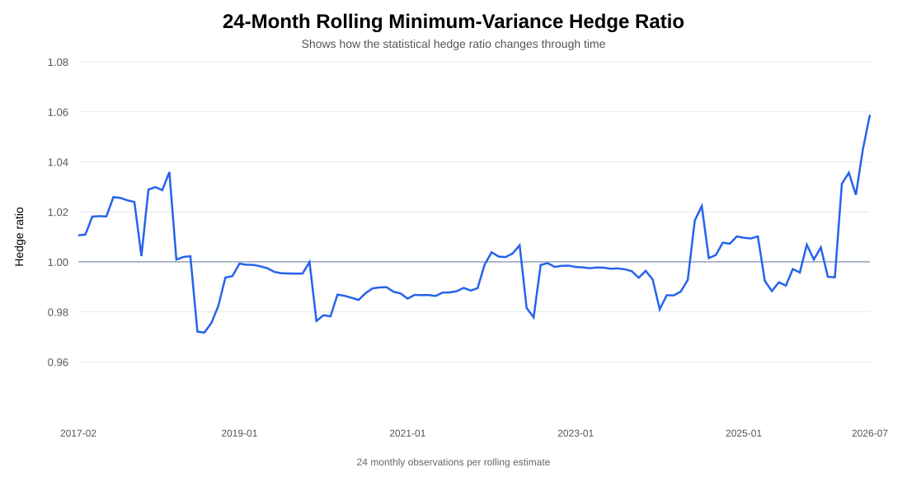
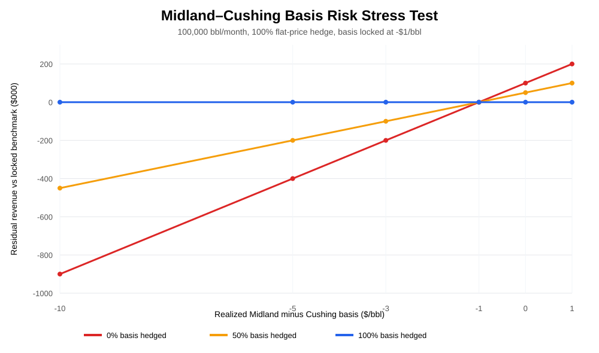

# WTI Producer Hedge Simulator

A Python project that shows how a crude oil producer can use WTI futures to reduce price and revenue risk.

The example assumes the producer expects to sell **100,000 barrels of oil per month**.

## What this project does

The model compares several hedge sizes:

- 0% hedged
- 25% hedged
- 50% hedged
- 75% hedged
- 100% hedged

It then measures how much each hedge reduces the producer's revenue risk.

The project also looks at:

- Midland vs. Cushing basis risk
- minimum-variance hedge sizing
- stress testing
- physical revenue plus futures P&L

## Main results

Using historical data from **February 2015 through July 2026**:

| Hedge ratio | CL contracts short | Revenue volatility | Hedge effectiveness |
|---:|---:|---:|---:|
| 0% | 0 | $711,294 | 0.0% |
| 25% | 25 | $540,295 | 42.3% |
| 50% | 50 | $373,697 | 72.4% |
| 75% | 75 | $221,653 | 90.3% |
| 100% | 100 | $142,693 | 96.0% |

A **75% hedge** reduced modeled revenue risk by about **90%**.

A **100% hedge** reduced it by about **96%**.





## Finding the hedge size that reduced risk the most

Instead of only testing fixed hedge sizes, the project also estimates a **minimum-variance hedge ratio**.

In simple terms, this asks:

> Based on the historical relationship between WTI spot prices and futures prices, what hedge size would have reduced price risk the most?

The historical estimate was **1.016**.

For 100,000 barrels of monthly production, that is about **102 CL futures contracts** after rounding.

Using that hedge size reduced monthly price-change variance by about **96.6%**.



The project also calculates the hedge ratio over rolling 24-month periods. This shows that the hedge size that works best can change as the market changes.



This is a statistical result, not a recommendation to hedge more than actual production. A real trading or risk desk would also consider production uncertainty, hedge limits, liquidity, accounting rules, and company risk policy.

## Midland vs. Cushing basis risk

A producer may sell crude in **Midland, Texas** while using WTI futures priced from **Cushing, Oklahoma**.

Those two prices do not always move by the same amount.

That difference is called **basis risk**.

In this project:

```text
Midland basis = Midland price - Cushing price
```

This means a producer can hedge the overall move in WTI and still lose money if Midland becomes cheaper relative to Cushing.

### Example

Assume:

- monthly production = 100,000 barrels
- expected Midland basis = -$1/bbl
- actual Midland basis = -$5/bbl
- WTI price risk is already fully hedged

The basis moved **$4/bbl against the producer**.

That creates a modeled revenue shortfall of:

```text
$4 × 100,000 barrels = $400,000
```

With a 50% basis hedge, the remaining shortfall is about **$200,000**.

With a full basis hedge in the model, that basis move is offset.



The basis section is a **stress-test example**, not a historical Midland cash-price backtest.

Public filings show that producers have used Midland differential swaps to manage this type of location risk.

- [EIA: WTI Cushing spot-market definition](https://www.eia.gov/dnav/pet/TblDefs/pet_pri_spt_tbldef2.asp)
- [SEC/EOG disclosure: Midland Differential basis swaps](https://www.sec.gov/Archives/edgar/data/821189/000082118919000020/a2019033110-q.htm)

## How the hedge works

A crude producer is exposed to falling oil prices because lower prices reduce the value of future production.

To reduce that risk, the producer can sell WTI futures.

If WTI falls:

- physical oil revenue falls
- the short futures position gains

If WTI rises:

- physical oil revenue rises
- the short futures position loses

The goal is not to make the most money from the futures position.

The goal is to make the producer's total revenue more stable.

## Basic model

For monthly production `Q` and hedge ratio `h`:

```text
Hedged barrels = Q × h
```

One NYMEX CL futures contract represents **1,000 barrels**:

```text
CL contracts = hedged barrels / 1,000
```

Futures P&L for the short hedge:

```text
Futures P&L =
(entry futures price - exit futures price) × hedged barrels
```

Total modeled revenue:

```text
Total revenue =
physical oil revenue + futures P&L
```

## What I wanted to show with this project

This project connects futures trading concepts to a real commercial energy problem.

It demonstrates:

- how physical oil exposure can be hedged with futures
- how hedge size affects risk
- how futures P&L combines with physical revenue
- why a full WTI hedge does not remove every type of risk
- how location basis risk works
- how historical data can be used to estimate a hedge ratio
- how Python can be used for commodity risk analysis

## Project structure

```text
wti-producer-hedge-simulator/
├── README.md
├── requirements.txt
├── run_analysis.py
├── src/
│   ├── hedge_engine.py
│   ├── basis_risk.py
│   └── min_variance.py
├── notebooks/
│   └── WTI_Producer_Hedge_Simulator.ipynb
├── data/
│   └── README.md
└── outputs/
    ├── hedge_ratio_summary.csv
    ├── monthly_analysis.csv
    ├── hedge_effectiveness.svg
    ├── revenue_surprise_history.svg
    ├── basis_risk_scenarios.csv
    ├── basis_risk_stress.svg
    ├── min_variance_summary.csv
    ├── min_variance_comparison.svg
    └── rolling_min_variance_ratio.svg
```

## Run the project

```bash
python -m venv .venv
pip install -r requirements.txt
python run_analysis.py
```

## Data

The model uses:

- WTI Cushing spot-price data from public FRED/EIA sources
- a continuous front-month WTI futures price series based on Yahoo Finance `CL=F`

The committed historical snapshot uses public mirrors for reproducibility:

- [WTI spot dataset](https://github.com/datasets/oil-prices)
- [WTI futures history](https://github.com/JavierLuqueGarcia/Crude-oil-Backtest)

## Glossary

Here are the main terms used in the project:

| Term | Simple meaning |
|---|---|
| **WTI** | West Texas Intermediate, a major U.S. crude-oil price benchmark. |
| **CL** | The ticker used for NYMEX WTI crude-oil futures. One CL contract represents 1,000 barrels. |
| **Physical crude** | The actual oil a producer sells. |
| **Futures contract** | A contract tied to the future price of oil. |
| **Hedge** | A position used to reduce price risk. |
| **Short futures** | Selling futures so the position can gain value if oil prices fall. |
| **Hedge ratio** | The percentage of expected production that is hedged. |
| **P&L** | Profit and loss from a position. |
| **Basis** | The price difference between two related crude-oil prices or locations. |
| **Basis risk** | The risk that those two prices do not move together. |
| **Basis swap** | A contract used to hedge a price difference between two locations or benchmarks. |
| **Cushing** | Oklahoma delivery point used for NYMEX WTI futures pricing. |
| **Midland** | A major crude-oil pricing location in the Permian Basin. |
| **Revenue surprise** | The difference between expected revenue and what the model actually produced. |
| **Hedge effectiveness** | How much the hedge reduced revenue risk. |
| **Minimum-variance hedge ratio** | The hedge size that historically reduced price movement the most in the model. |
| **Volatility** | How much prices or revenue move up and down. |
| **Stress test** | A test showing what happens under a large or unfavorable market move. |
| **Continuous futures series** | A price history that links several futures contracts together over time. |
| **ETRM** | Energy Trading and Risk Management system used to track trades, positions, risk, and settlements. |

## Limitations

This is a portfolio project, not a production trading or ETRM system.

A real implementation would use:

- individual futures contracts instead of only a continuous futures series
- contract expiration and roll rules
- actual location and quality differentials
- transaction costs
- margin and liquidity limits
- production uncertainty
- counterparty and credit risk

## Possible next steps

- contract-specific Midland basis data
- WTI vs. Brent cross-hedging
- producer collars and put options
- VaR and stress testing
- Streamlit risk dashboard

## Why I built it

I am interested in energy markets, futures, risk, and commercial trading.

I built this project to apply futures concepts to a real crude-oil producer's risk problem instead of using futures only for directional trading.

---

**Disclaimer:** Educational and portfolio use only. Not investment advice.
