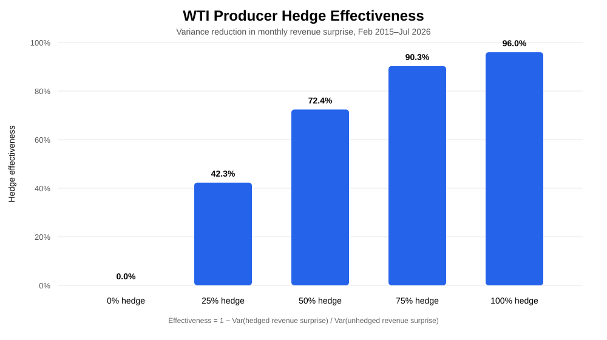
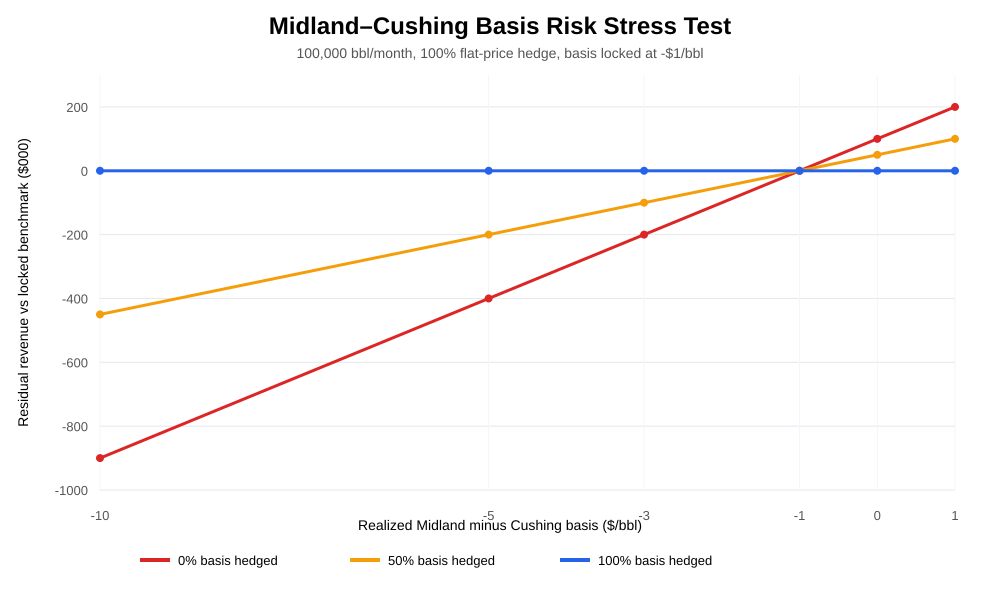
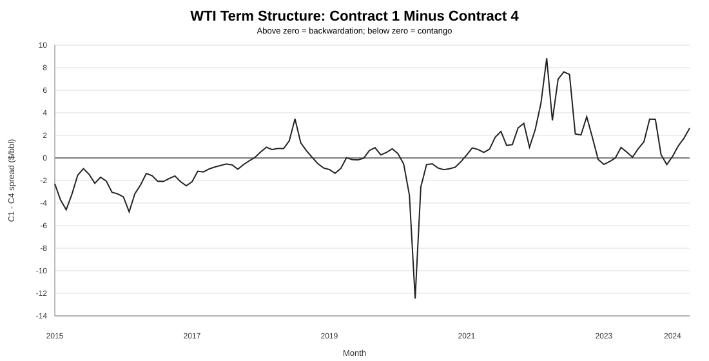

# WTI Producer Hedging & Market Risk Analytics

[](https://github.com/akilatrades/wti-producer-hedge-simulator/actions/workflows/tests.yml)

Python-based analysis of crude-oil producer price exposure, WTI futures hedging, Midland-Cushing basis risk, hedge-ratio stability, and WTI term structure.

The project is designed as a compact energy-risk research framework: identify a physical exposure, apply a derivative hedge, measure residual risk, stress the assumptions, and validate the model.

> **One-line summary:** model a producer's WTI exposure and evaluate how fixed and statistically estimated futures hedges change revenue volatility, tail risk, basis exposure, and contract-level hedge requirements.

> **Project status:** Version 1.0 is complete. The core analytical scope is frozen as a stable release; future changes will focus on maintenance, data refreshes, or targeted extensions when they add clear value.

## 5-minute project review

For a quick review of the project:

1. Start with **Current results** below for the business question and headline findings.
2. Read the management-style [generated executive summary](outputs/executive_summary.md) for findings, residual risks, and model-use considerations.
3. Open [01 - Hedge Effectiveness](notebooks/01_hedge_effectiveness.ipynb) to see the core producer/futures hedge problem in a short guided notebook.
4. Review [Model limitations](docs/limitations.md) for data, model, and production-use constraints.
5. Inspect `src/` and `tests/` for the reusable analytical code and automated validation.

**Skills demonstrated:** energy-market analysis, WTI futures, commodity hedging, exposure analysis, P&L attribution, basis risk, VaR / Expected Shortfall, term structure, model validation, Python, pandas, pytest, and GitHub Actions.


## Current results

The example producer is assumed to sell **100,000 barrels of oil per month**. The model tests how much price risk could have been reduced by selling WTI futures against that production.

| What the result means | Result |
|---|---:|
| Monthly revenue volatility with no hedge | $711,294 |
| Risk reduction with 75% of production hedged | 90.3% |
| Risk reduction with 100% of production hedged | 96.0% |
| Model-estimated best hedge size | 101.6% of expected production |
| How closely spot and futures prices moved together | 0.983 correlation |
| Practical hedge size after rounding to whole contracts | 102 CL contracts |
| Risk reduction using that rounded hedge | 96.6% |
| Estimated range for the best hedge ratio | 99.2% to 103.9% |
| Remaining price volatility using the rolling model | $1.461 per barrel |
| Remaining price volatility using a simple 100% hedge | $1.466 per barrel |



### Plain-English takeaway

In this historical sample, WTI futures did a very good job of reducing the producer's exposure to changes in oil prices. Hedging 75% of expected production reduced modeled price-related volatility by about **90%**, while a full hedge reduced it by about **96%**.

The statistical model estimated that the lowest-volatility hedge was very close to simply hedging **100% of expected production**. Its estimate was about **101.6%**, and repeated resampling placed the likely range between roughly **99% and 104%**.

The more advanced rolling test reached a similar conclusion: its remaining price volatility was only slightly lower than a simple 100% hedge. In other words, the model supports the idea that a straightforward full hedge worked nearly as well as the more complex statistical hedge in this sample.

These are historical model results, not a recommendation for a real producer. A real hedging program would also have to consider production uncertainty, location differences between physical oil and the futures contract, trading costs, margin requirements, liquidity, accounting rules, and company risk limits.

## What the project covers

### 1. Producer flat-price hedge

Compares 0%, 25%, 50%, 75%, and 100% futures hedges and measures:

- physical revenue,
- futures P&L,
- hedged revenue,
- residual revenue surprise,
- hedge effectiveness.

### 2. Market-risk metrics

Adds a risk-manager view of the same hedge strategies:

- monthly and annualized volatility,
- 95% and 99% historical Value at Risk,
- Expected Shortfall,
- downside deviation,
- worst historical modeled loss.

### 3. P&L attribution

Separates the result into:

```text
Physical flat-price effect
+ Futures hedge effect
= Residual flat-price result
```

The objective is to explain **why** the hedge result moved, not only whether it was positive or negative.

### 4. Midland-Cushing basis risk

Models the residual location risk created when a producer sells Midland crude but hedges with Cushing-linked WTI futures.



### 5. Minimum-variance hedge estimation

Estimates:

```text
h* = Cov(ΔSpot, ΔFutures) / Var(ΔFutures)
```

and compares the historical residual variance with fixed hedge ratios.


### 6. Model validation

The project now tests the minimum-variance estimate using:

- rolling 24-month hedge ratios,
- walk-forward / out-of-sample testing,
- bootstrap confidence intervals.

The goal is to avoid presenting one in-sample hedge ratio as if it were a permanent constant.

### 7. Producer hedge ladder

Maps expected production across future months into:

- hedge percentages,
- whole CL contracts,
- hedged and unhedged barrels,
- futures notional.

This adds the contract-month dimension that a one-period hedge ratio cannot show.

### 8. Production uncertainty

Stress-tests actual production above and below forecast production and identifies:

- under-hedged barrels,
- over-hedged barrels,
- residual revenue effects.

This makes production-volume risk explicit.

### 9. WTI term structure

Analyzes historical EIA WTI Contract 1-4 prices using:

- C1-C2, C1-C3, and C1-C4 spreads,
- backwardation / contango / flat regimes,
- curve slope,
- curve curvature,
- rolling z-scores,
- historical spread percentiles.



### 10. Optional physical-market context

A separate module can join the curve data to EIA-style variables such as:

- commercial crude inventories,
- Cushing inventories,
- refinery utilization,
- crude production,
- imports,
- exports.

This module is descriptive and does not claim that one inventory print mechanically predicts the next WTI move.

## Architecture

```text
Public market data
      |
      v
Physical exposure assumptions
      |
      +--> Fixed hedge ratios
      |
      +--> Minimum-variance hedge estimate
      |
      +--> Basis-risk scenarios
      |
      +--> Production-volume scenarios
      |
      +--> Multi-month hedge ladder
      |
      v
Risk measurement
      |
      +--> Volatility / VaR / ES
      +--> P&L attribution
      +--> Walk-forward validation
      +--> Bootstrap uncertainty
      |
      v
WTI term-structure / physical-market context
```

## Repository structure

```text
.
├── README.md
├── CHANGELOG.md
├── pyproject.toml
├── requirements.txt
├── run_analysis.py
├── src/
│   ├── hedge_engine.py
│   ├── basis_risk.py
│   ├── min_variance.py
│   ├── risk_metrics.py
│   ├── pnl_attribution.py
│   ├── hedge_ladder.py
│   ├── scenarios.py
│   ├── validation.py
│   ├── term_structure.py
│   └── fundamentals.py
├── docs/
│   ├── methodology.md
│   ├── hedge_model.md
│   ├── basis_risk.md
│   ├── risk_metrics.md
│   ├── hedge_book.md
│   ├── validation.md
│   ├── term_structure.md
│   ├── fundamentals.md
│   ├── data_dictionary.md
│   ├── limitations.md
│   └── glossary.md
├── data/
├── notebooks/
│   └── archive/
├── outputs/
└── tests/
```

## Quick start

```bash
python -m venv .venv
source .venv/bin/activate      # Windows: .venv\Scripts\activate
pip install -r requirements.txt
pytest
python run_analysis.py
```

`run_analysis.py` refreshes the core tables and charts in `outputs/`.

The analysis attempts to download WTI spot and futures data. The historical EIA C1-C4 curve module uses the saved repository snapshot if the EIA table is unavailable.

## Generated analytical outputs

The expanded analysis can generate:

- `hedge_ratio_summary.csv`
- `monthly_analysis.csv`
- `risk_summary.csv`
- `pnl_attribution.csv`
- `basis_risk_scenarios.csv`
- `illustrative_hedge_ladder.csv`
- `production_uncertainty_scenarios.csv`
- `min_variance_summary.csv`
- `rolling_min_variance_ratio.csv`
- `walk_forward_validation.csv`
- `bootstrap_hedge_ratio_summary.csv`
- `term_structure_monthly.csv`
- `term_structure_regime_behavior.csv`
- `executive_summary.md`

See [outputs/README.md](outputs/README.md) for the reporting layer.

## Data

The project uses public market data and saved snapshots for reproducibility.

Primary sources / proxies include:

- FRED / EIA WTI Cushing spot data,
- Yahoo Finance `CL=F` as a continuous front-month WTI futures proxy,
- EIA historical NYMEX Contract 1-4 price tables.

See [data/README.md](data/README.md) for data provenance and caveats.

## Documentation

The README is intentionally written for a quick professional review.

For the full methodology:

- [Methodology](docs/methodology.md)
- [Producer hedge model](docs/hedge_model.md)
- [Basis risk](docs/basis_risk.md)
- [Risk metrics](docs/risk_metrics.md)
- [Hedge ladder](docs/hedge_book.md)
- [Validation](docs/validation.md)
- [Term structure](docs/term_structure.md)
- [Physical market context](docs/fundamentals.md)
- [Model limitations](docs/limitations.md)
- [Glossary](docs/glossary.md)

## Key limitations

This is an analytical research project, not an ETRM or production hedge-management system.

Important simplifications include:

- continuous futures rather than exact traded contracts,
- simplified month-end hedge timing,
- no transaction costs or margin modeling,
- simplified physical pricing,
- scenario-based Midland/Cushing basis analysis,
- no hedge-accounting or credit treatment,
- historical rather than live C1-C4 curve data.

A full discussion is in [docs/limitations.md](docs/limitations.md).

## Why this project exists

The project connects futures-market analysis with the economics of a physical energy business.

Instead of asking only whether WTI will rise or fall, it asks:

> What is the producer exposed to, which instrument offsets that risk, what remains after the hedge, and how stable is the model used to size it?

That is the core risk-management problem the repository is designed to demonstrate.

Educational and portfolio use only. Not investment advice.
