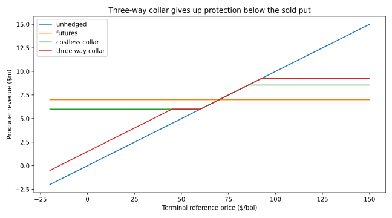

# WTI producer hedge simulator

How much price risk can a crude producer remove with WTI hedges, and what is left over?

The original historical test puts the minimum-variance hedge ratio at **1.016**, close to a simple full hedge. That is an expected result: CL converges to deliverable WTI at Cushing at expiry, and this model uses Cushing spot as its physical-price proxy. It is not evidence of a trading edge. The useful questions are basis, uncertain production and the protection a hedge gives up in a severe selloff.

## What the results show

The original saved sample assumes 100,000 barrels per month. A full futures hedge reduces the variance of modeled revenue surprises by about 96%. The rolling estimated hedge leaves $1.461/bbl of residual standard deviation, versus $1.466/bbl for a fixed full hedge. That small difference is a reason to question whether the extra model complexity helps.

[Historical result tables](outputs/README.md) · [Walk-forward validation](docs/validation.md)

### Swaps and collars

The new terminal-payoff comparison uses a $70 forward, a $60 put floor, 40% assumed volatility, one year to expiry and 100,000 barrels. Black-76 gives a zero-premium collar ceiling of **$85.54**. Selling a second put at $45 increases the ceiling to **$92.67**, but below $45 the producer loses dollar for dollar again.

| Structure | Revenue at a $20 terminal price, zero basis |
|---|---:|
| Unhedged | $2.0m |
| Full futures hedge | $7.0m |
| Fixed-price swap | $7.0m |
| Costless collar | $6.0m |
| Three-way collar | $3.5m |



The simulated worst-5% average revenue is about **$6.00m** for the collar versus **$4.35m** for the three-way structure. Those are assumption-based, risk-neutral simulations, not historical performance or forecasts. Futures and swaps have identical terminal payoffs under this setup; their margin, funding and credit demands differ in practice.

[Comparison and assumptions](outputs/structures/README.md) · [Instrument methodology](docs/hedge_structures.md)

### Observed basis versus location stress

The saved monthly Cushing spot minus front-month futures proxy averages $0.34/bbl, with a $1.43/bbl standard deviation across 138 observations. That includes roll/timing effects and the 2020 disruption. **It is not Midland–Cushing location basis.** The observed benchmark series and assumed location shocks are saved separately; a verified Midland history remains a data gap.

[Observed benchmark basis](outputs/structures/observed_benchmark_basis.csv) · [Location stress grid](outputs/structures/basis_stress.csv)

### Crude-storage carry project

[Crude-storage carry](projects/crude-storage-carry/README.md) asks when C1-to-C4 contango covers storage, financing, insurance and handling. Across 111 full historical months, 59 had positive contango but only 12 covered the default assumed costs. The project is self-contained under `projects/` and can be split into its own repository.

## Run it

```bash
pip install -r requirements.txt
pytest
python run_structures.py
cd projects/crude-storage-carry
python -m unittest -v test_model
python run_analysis.py
```

The new structure and carry analyses run from committed inputs. To refresh the original spot/futures analysis, run `python run_analysis.py` from the repository root; it requires network access to FRED and Yahoo. The EIA C1–C4 snapshot ends in April 2024 because that source was discontinued; the carry study excludes the partial final month.

The original notebooks and modules also cover hedge ladders, production uncertainty, P&L attribution, term structure, bootstrap intervals and walk-forward hedge ratios. Start with [the notebook guide](notebooks/README.md) or [methodology](docs/methodology.md).

## What I learned / what I would do differently

A hedge ratio near one is a useful sanity check when both sides reference Cushing. I would spend the next data budget on physical location prices and dated contract settlements before optimizing that ratio further. A zero-premium structure is not free protection: the sold options determine where the producer is exposed again.

The next improvement is an observed Midland–Cushing series and monthly average-price settlement, followed by volume, margin and credit constraints. Black-76 here prices European terminal-settled options with positive forward prices. It does not price American exercise or averaging, and it cannot handle negative forwards. The expiry payoff stress can still show negative terminal prices.

Public and synthetic research inputs only; no employer or client data. See [limitations](docs/limitations.md).

The [storage project now includes observed Cushing inventories](projects/crude-storage-carry/README.md): 10 of 12 months with carry covering assumed costs coincided with stock builds, versus 46 of 99 other months. This is a descriptive monthly comparison, not a trading signal.
