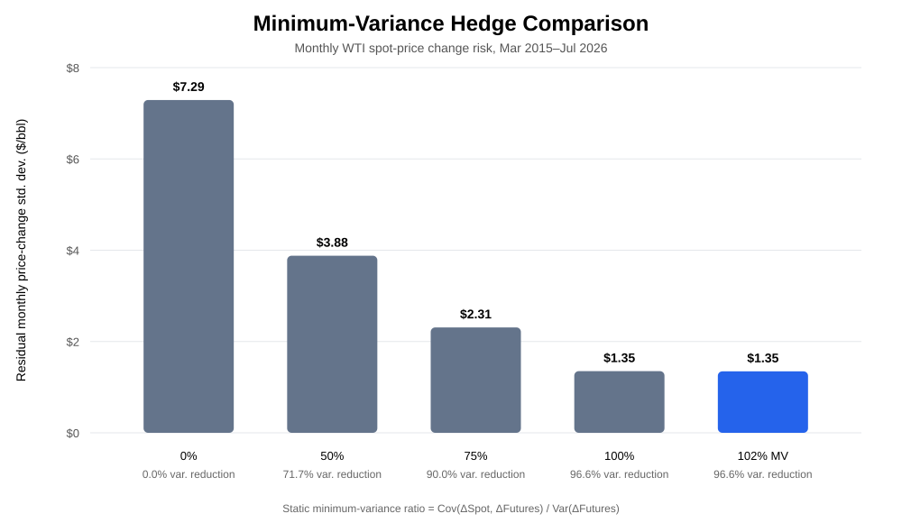
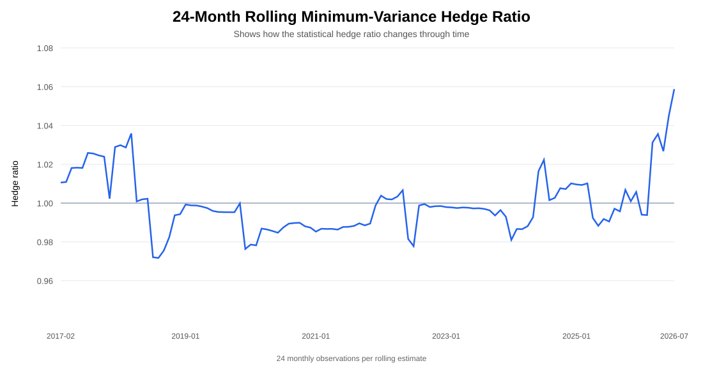

# Minimum-Variance Hedge Results

Historical sample: **March 2015 – July 2026** for monthly price changes.

## Static estimate

The classical minimum-variance hedge ratio is:

```text
h* = Cov(ΔSpot, ΔFutures) / Var(ΔFutures)
```

Saved point estimate:

- estimated hedge ratio: **1.016**
- whole-contract implementation for 100,000 bbl/month: **102 CL contracts**
- rounded hedge ratio: **1.02**
- spot/futures monthly-change correlation: **0.983**
- unhedged monthly price-change volatility: **$7.29/bbl**
- rounded residual price-change volatility: **$1.35/bbl**
- rounded variance reduction: **96.6%**



## Why the point estimate is not enough

A ratio of 1.016 should not be interpreted as a permanent or operational instruction to hedge 101.6% of expected production.

The expanded project checks the estimate in three additional ways.

### Rolling estimate

A 24-month rolling hedge ratio shows whether the spot/futures relationship changes through time.



### Walk-forward validation

`walk_forward_validation.csv` estimates the ratio using only the trailing historical window and applies it to the next unseen monthly observation.

`walk_forward_validation_summary.csv` compares the out-of-sample residual volatility with a simple 1.0 hedge benchmark.

### Bootstrap uncertainty

`bootstrap_hedge_ratio_summary.csv` reports a 95% resampling interval around the point estimate.

This makes sampling uncertainty visible instead of presenting the third decimal place as certain.

## Commercial interpretation

The minimum-variance ratio is a statistical benchmark.

A producer can rationally hedge less than the statistical estimate because of:

- production uncertainty,
- internal hedge limits,
- liquidity,
- basis risk,
- margin usage,
- credit,
- accounting treatment,
- management's desired upside participation.

See [model validation](../docs/validation.md) and [limitations](../docs/limitations.md) for the full discussion.
