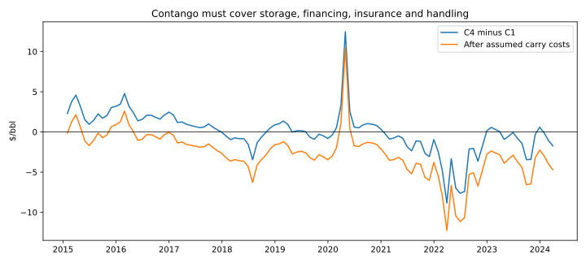
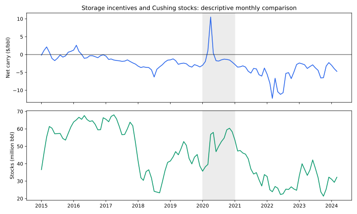

# When does storing crude pay?

A rising futures curve is only the start of the calculation. Does the deferred sale price cover acquisition, storage, financing, insurance and handling?

In the committed EIA sample, **59 of 111 full months were in C1-to-C4 contango; only 12 covered the default assumed costs**.



## Does carry coincide with Cushing filling up?

In this sample, **10 of 12 positive-net-carry months had inventory builds (83.3%)**, versus **46 of 99 other months (46.5%)**. Average monthly stock changes were +4.00 million barrels and −0.46 million barrels respectively. Excluding 2020 leaves 8/9 versus 40/90 build months, so the association is not solely a pandemic observation.



The [physical comparison](outputs/physical_layer/regime_comparison.csv) joins the same 111 monthly curve observations to [EIA weekly Cushing crude stocks excluding SPR](https://www.eia.gov/dnav/pet/hist/LeafHandler.ashx?n=PET&s=W_EPC0_SAX_YCUOK_MBBL&f=W). Stocks are converted from thousand to million barrels. Monthly average stocks describe inventory levels; monthly builds use the last weekly observation in each month minus the previous month's last observation. The prior December is retained for the first change. Month-end curve labels are normalized to monthly periods before joining; missing inventory coverage fails rather than being interpolated.

Net carry and monthly inventory change have correlation 0.37, or 0.27 excluding 2020. [The 2020 detail](outputs/physical_layer/2020_detail.csv) and [complete monthly alignment](outputs/physical_layer/monthly_alignment.csv) show the observations behind the summary.

## Economics

Buy for delivery at C1, store for an assumed three months, and sell for C4 delivery. Per barrel:

`net carry = C4 - C1 - 3*monthly storage - C1*(exp(r*3/12)-1) - C1*insurance*3/12 - handling`

| Input | Default assumption |
|---|---:|
| Storage duration | 3 months |
| Storage | $0.50/bbl/month |
| Annual financing, continuously compounded | 6% |
| Annual insurance on acquisition value | 0.3% |
| Round-trip handling | $0.20/bbl |

Costs are held constant at the stated assumptions. Acquisition is financed from C1 delivery; storage, insurance and handling are treated as terminal expenses without additional financing. `cost_sensitivity.csv` varies storage from $0.25 to $1.00 and financing from 3% to 10%. `carry_history.csv` also calculates the maximum monthly storage fee the spread could support; a negative value means even free storage would not cover the other costs.

## Data and scope

The committed snapshot contains EIA monthly averages of NYMEX delivery positions C1–C4. The analysis uses January 2015–March 2024; April 2024 is excluded because the source stopped April 5.

Source pages: [C1](https://www.eia.gov/dnav/pet/hist/LeafHandler.ashx?n=PET&s=RCLC1&f=M), [C2](https://www.eia.gov/dnav/pet/hist/LeafHandler.ashx?n=PET&s=RCLC2&f=M), [C3](https://www.eia.gov/dnav/pet/hist/LeafHandler.ashx?n=PET&s=RCLC3&f=M), [C4](https://www.eia.gov/dnav/pet/hist/LeafHandler.ashx?n=PET&s=RCLC4&f=M). Input inherited from the parent repository; exact checksum is saved with the results.

## Reproduce

From this directory, with pandas, numpy and matplotlib installed:

```bash
python -m unittest -v test_model
python run_analysis.py
```

The physical layer uses the committed inventory snapshot:

```bash
pip install xlrd pytest
pytest test_model.py test_physical_layer.py
python physical_layer.py
# Optional refresh from EIA; replaces the historical inventory vintage:
python physical_layer.py --download
```

All inputs are committed. Outputs include the monthly decomposition, cost sensitivity and chart. This directory is self-contained for a future separate repository.

## What I learned / what I would do differently

The curve needs to pay for the whole carrying period, not just look upward sloping. I would replace constant costs with dated terminal quotes and financing assumptions, then use daily executable contract prices and actual delivery calendars.

## Limitations

Monthly average curves and assumed constant costs make this an economics screen rather than an executable trading backtest. The three-month duration is approximate; terminal access, capacity, delivery timing, quality, transport, shrinkage, credit, margin and liquidity are omitted. Inventory dates are week-ending observations, so the contemporaneous comparison does not establish a predictive signal or causality. Positive carry occurs in only 12 months, and observations are serially dependent.
